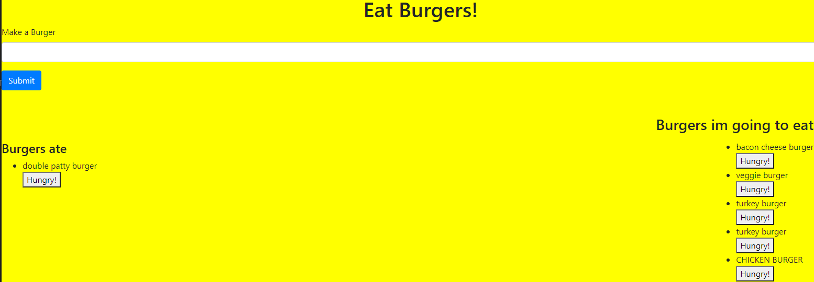

# Burgers
    
#Created on 08/29/2020

# By Brandon Perez

# Screen Shot
 

## Table of Contents
* [Description](#Description)
* [Installation](#Installation)
* [Knoun-bugs](#Known-bugs)
* [Technologies-Used](#Technologies-Used)
* [Contribution](#Contribution)
* [License](License)

## Description 
This app allows users to track the burgers they eat.
    
## Installation
1- git clone, 2- npm i, 3- node server.js
    
## Known bugs
N/A
    
## Contact Information
brandonp940@gmail.com
    
## Technologies Used 
JavaScript, Node.js
    
## Contribution
https://pure-savannah-18028.herokuapp.com/
    
### License
MIT
